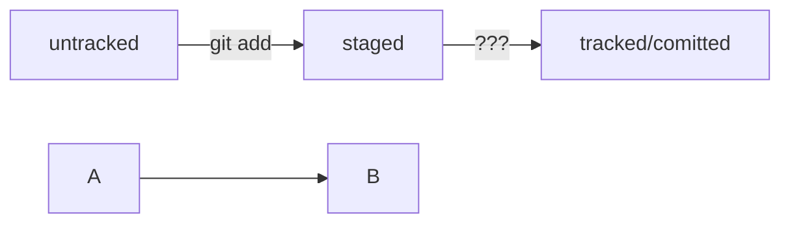

# Навигация
**pwd** (от англ. print working directory, «показать рабочую папку») — покажи, в какой я папке;

**ls** (от англ. list directory contents, «отобразить содержимое директории») — покажи файлы и папки в текущей папке;

**ls -a** — покажи также скрытые файлы и папки, названия которых начинаются с символа .;

**cd first-project** (от англ. change directory, «сменить директорию») — перейди в папку first-project;

**cd first-project/html** — перейди в папку html, которая находится в папке first-project;

_cd .._ — перейди на уровень выше, в родительскую папку;

_cd ~_ — перейди в домашнюю директорию (/Users/Username);

_cd /_ — перейди в корневую директорию.

# Работа с файлами и папками
## Создание
touch index.html (англ. touch, «коснуться») — создай файл index.html в текущей папке;
touch index.html style.css script.js — если нужно создать сразу несколько файлов, можно напечатать их имена в одну строку через пробел;
mkdir second-project (от англ. make directory, «создать директорию») — создай папку с именем second-project в текущей папке.
## Копирование и перемещение
cp file.txt ~/my-dir (от англ. copy, «копировать») — скопируй файл в другое место;
mv file.txt ~/my-dir (от англ. move, «переместить») — перемести файл или папку в другое место.
## Чтение
cat file.txt (от англ. concatenate and print, «объединить и распечатать») — распечатай содержимое текстового файла file.txt.
##Удаление
rm about.html (от англ. remove, «удалить») — удали файл about.html;
rmdir images (от англ. remove directory, «удалить директорию») — удали папку images;
rm -r second-project (от англ. remove, «удалить» + recursive, «рекурсивный») — удали папку second-project и всё, что она содержит.
## Полезные возможности
Команды необязательно печатать и выполнять по очереди. Можно указать их списком — разделить двумя амперсандами (&&).
У консоли есть собственная память — буфер с несколькими последними командами. По ним можно перемещаться с помощью клавиш со стрелками вверх (↑) и вниз (↓).
Чтобы не вводить название файла или папки полностью, можно набрать первые символы имени и дважды нажать Tab. Если файл или папка есть в текущей директории, командная строка допишет путь сама.

Например, вы находитесь в папке dev. Начните вводить cd first и дважды нажмите Tab. Если папка first-project есть внутри dev, командная строка автоматически подставит её имя. Останется только нажать Enter.

# Инициализация репозитория
git init (от англ. initialize, «инициализировать») — инициализируй репозиторий.
#Подготовка файла к коммиту
git add todo.txt (от англ. add, «добавить») — подготовь файл todo.txt к коммиту;
git add --all (от англ. add, «добавить» + all, «всё») — подготовь к коммиту сразу все файлы, в которых были изменения, и все новые файлы;
git add . — подготовь к коммиту текущую папку и все файлы в ней.
#Создание коммита
git commit -m "Комментарий к коммиту." (от англ. commit, «совершать», «фиксировать» + message, «сообщение») — сделай коммит и оставь комментарий, чтобы было проще понять, какие изменения внесены. 
#Просмотр информации о коммитах
git log (от англ. log, «журнал [записей]») — выведи подробную историю коммитов.
#Просмотр состояния файлов
git status (от англ. status, «статус», «состояние») — покажи текущее состояние репозитория.

**git pull origin main** обновить данные на компе после внесения в локальном репозитории

Синхронизация локального и удалённого репозиториев
git remote add origin https://github.com/YandexPracticum/first-project.git (от англ. remote, «удалённый» + add, «добавить») — привяжи локальный репозиторий к удалённому с URL https://github.com/YandexPracticum/first-project.git;

git remote -v (от англ. verbose, «подробный») — проверь, что репозитории действительно связались;

git push -u origin main (от англ. push, «толкать») — в первый раз загрузи все коммиты из локального репозитория в удалённый с названием origin.

git push (от англ. push, «толкать») — загрузи коммиты в удалённый репозиторий после того, как он был привязан с помощью флага -u.


Копирование чужих репозиториев
Клонирование
git clone git@github.com:TheGreatOwner/the-great-project.git (от англ. clone, «клон», «копия») — склонируй репозиторий с URL the-great-project.git из аккаунта TheGreatOwner на мой локальный компьютер.


# Хеш, лог и HEAD 

**Хеширование** (от англ. hash, «рубить», «крошить», «мешанина») — это способ преобразовать набор данных и 
получить их «отпечаток» (англ. fingerprint).

Таблица соответствия хеш → информация о коммите хранится в папке .git.
Git хранит всю свою служебную информацию в этой папке, в том числе и таблицу, в которой можно найти коммит по хешу.

Основной идентификатор коммита — это его хеш.
Эта странная, но важная строка служит главным идентификатором коммита.

Если посчитать хеш одного и того же файла (одним и тем же алгоритмом) на двух разных компьютерах, то результат будет гарантированно одинаковым.
Хеш-алгоритм выдаст одно и то же значение для одного набора данных — это не зависит от того, где и как он был запущен.

**git log --oneline** - Сокращённый хеш (первые несколько символов полного) можно использовать точно так же, как и полный.

## HEAD — всему голова
При вызове команды git log вы также могли заметить надпись (HEAD -> master) после хеша одного из коммитов.
Файл HEAD (англ. «голова», «головной») — один из служебных файлов папки .git. 
Он указывает на коммит, который сделан последним (то есть на самый новый).
Внутри HEAD — ссылка на служебный файл: refs/heads/master (или refs/heads/main в зависимости от названия ветки). 
Если заглянуть в этот файл, можно увидеть хеш последнего коммита.

**cat refs/heads/mastern** - взяли ссылку из файла Head

Когда вы делаете коммит, Git обновляет refs/heads/master — записывает в него хеш последнего коммита. 
Получается, что HEAD тоже обновляется, так как ссылается на refs/heads/master.


## Зачем нужны статусы файлов и как читать git status

### Статусы untracked/tracked, staged и modified

• **untracked** (англ. «неотслеживаемый») 
Новые файлы в Git-репозитории помечаются как untracked, то есть неотслеживаемые. Git «видит», что такой файл существует, 
но не следит за изменениями в нём. У untracked-файла нет предыдущих версий, зафиксированных в коммитах или через команду git add. 

• **staged** (англ. «подготовленный») 
После выполнения команды git add файл попадает в staging area (от англ. stage — «сцена», «этап [процесса]» и area — «область»), 
то есть в список файлов, которые войдут в коммит. В этот момент файл находится в состоянии staged.

• **tracked** (англ. «отслеживаемый») 
Состояние tracked — это противоположность untracked. Оно довольно широкое по смыслу: в него попадают файлы, 
которые уже были зафиксированы с помощью git commit, а также файлы, которые были добавлены в staging area командой git add. 
То есть все файлы, в которых Git так или иначе отслеживает изменения.
 
• ****modified**** (англ. «изменённый») 
Состояние modified значит, что Git сравнил содержимое файла с последней сохранённой версией и нашёл отличия. 
Например, файл был закоммичен и после этого изменён.
 
**Вот что ещё важно учесть:**
• Для файлов в состояниях **staged** и **modified** обычно не указывается, что они также tracked, потому что это состояние подразумевается.

• Команда **git add** добавляет в *staging area* только текущее содержимое файла. Если вы, например, сделаете git add file.txt, 
а затем измените file.txt, то новое содержимое файла не будет находиться в staging. Git сообщит об этом с помощью статуса modified: файл изменён относительно той версии, которая уже в staging. Чтобы добавить в staging последнюю версию, нужно выполнить git add file.txt ещё раз.


### Типичный жизненный цикл файла в Git

1. Файл только что создали. Git ещё не отслеживает его содержимое. Состояние: **untracked**.

2. Файл добавили в staging area с помощью git add. Состояние: **staged (+ tracked)**.
 a. Возможно, изменили файл ещё раз. Состояния: **staged, modified (+ tracked)**.
 Обратите внимание: staged и modified у одного файла, но у разных его версий.  
 b. Ещё раз **выполнили git add**. Состояние: **staged (+ tracked)**.

3. Сделали коммит с помощью git commit. Состояние: **tracked**.

4. Изменили файл. Состояние: **modified (+ tracked)**.

5. Снова **добавили в staging area** с помощью git add. Состояния: **staged (+ tracked)**.

6. Сделали коммит. Состояния: **tracked**.

7. Повторили пункты 4−7 много-много раз.

### Какие состояния показывает команда git status

Большинство файлов в типичном проекте будут находиться в состоянии tracked (то есть закоммичены и не изменены после коммита). 
Вы не увидите это состояние в выводе команды git status — иначе она бы каждый раз выводила список вообще всех файлов проекта. 
В итоге git status показывает только следующие состояния файлов:

- **staged** (Changes to be committed в выводе git status);
- **modified** (Changes not staged for commit);
- **untracked** (Untracked files).

### Четыре примера состояний, в которых может находиться ваш репозиторий.

1. **Нет ни staged-, ни modified-, ни untracked-файлов.**

Если ничего не менять в git-status-lesson после первого коммита, то в нём не должно быть ни изменённых файлов (modified), 
ни новых (untracked), ни добавленных в список на коммит (staged). Вызовите команду git status. Её вывод будет примерно таким.

$ git status
On branch master
nothing to commit, working tree clean 

Это означает, что в репозитории нет новых или изменённых файлов. Последняя строка nothing to commit, 
working tree clean переводится как «нечего коммитить, рабочая директория чиста». Первая строка On branch master сообщает, что текущая ветка — master.

2. **Найдены неотслеживаемые файлы.**

Создайте в папке ~/dev/git-status-lesson файл fileA.txt. Теперь в репозитории есть новый файл в состоянии untracked. 
Снова вызовите команду git status. Результат будет таким.

touch fileA.txt
git status
On branch master
Untracked files: # найдены неотслеживаемые файлы
  (use "git add <file>..." to include in what will be committed)
        fileA.txt

nothing added to commit but untracked files present (use "git add" to track) 

Файл fileA.txt отображается в секции неотслеживаемых файлов — Untracked files. Это значит, что он не был добавлен в репозиторий через git add.
В выводе git status есть подсказка, какую команду использовать, чтобы добавить файл в список на коммит: 
Use git add <file> to include in what will be committed (англ. «используйте git add <file>, чтобы добавить в список на коммит»). 
Добавьте fileA.txt в staging area с помощью git add и снова запросите git status.

$ git add fileA.txt 
$ git status
On branch master
Changes to be committed: # новая секция
  (use "git restore --staged <file>..." to unstage)
        new file:   fileA.txt 

Теперь fileA.txt находится в секции Changes to be committed (англ. «изменения, которые попадут в коммит»). 
Если сейчас выполнить коммит, то в репозитории будет зафиксирована текущая версия этого файла. Закоммитьте его.

$ git commit -m 'Добавить файл fileA.txt'
//тут будет вывод комманды commit, он нас не интересует
$ git status
On branch master
nothing to commit, working tree clean 

Вывод команды git status такой же, какой был после первого коммита: «Директория чиста».

3. **Найдены изменения, которые не войдут в коммит**
Теперь откройте файл fileA.txt и добавьте в него несколько слов — например, Это файл A!. 
Сохраните fileA.txt и вызовите команду git status. Её результат будет такой.

внесли в fileA.txt правки
запросили статус
$ git status 
On branch master
Changes not staged for commit: # ещё одна секция
  (use "git add <file>..." to update what will be committed)
  (use "git restore <file>..." to discard changes in working directory)
        modified:   fileA.txt 

Файл fileA.txt был изменён, но не добавлен в staging area после этого. Так он оказался в секции Changes not staged for commit 
(англ. «изменения, которые не подготовлены к коммиту»), соответствующей статусу modified. Подготовьте правки к коммиту через git add.

$ git add fileA.txt
$ git status
On branch master
Changes to be committed: # все изменения готовы к коммиту
  (use "git restore --staged <file>..." to unstage)
        modified:   fileA.txt 

Теперь в коммит попадёт уже новая версия файла fileA.txt. Обратите внимание: хотя вывод команды git status похож на тот, 
что был после первого добавления файла fileA.txt, они отличаются. Когда новый файл попадает в staging area, перед его 
названием указывается new file: new file: fileA.txt. Если файл уже однажды попадал в историю (с помощью коммита) и был изменён, 
после выполнения git add он будет записан уже так: modified: fileA.txt.


4. **Файл добавлен в staging area, но после этого изменён**

изменили fileA.txt
$ git status
On branch master
Changes to be committed:
  (use "git restore --staged <file>..." to unstage)
          modified:   fileA.txt

Changes not staged for commit:
  (use "git add <file>..." to update what will be committed)
  (use "git restore <file>..." to discard changes in working directory)
          modified:   fileA.txt 

Файл попал и в staged (Changes to be committed), и в modified (Changes not staged for commit). 
В staging area находится версия файла с одним восклицательным знаком, а 
в Changes not staged for commit — уже изменённая версия, с тремя. Чтобы закоммитить самую свежую версию файла,
нужно снова выполнить git add перед коммитом. Готово!


# Подсказка: как сделать mermaid-схему

Чтобы получить mermaid-схему в README.md, нужно добавить блок кода типа mermaid.
HEAD -- это голова.
Коммит -- это всему голова.
Статусы файлов:
<тут пустая строка!>

```mermaid
%% описание схемы
```
<и тут пустая строка!> 

Разберём те правила синтаксиса, которые понадобятся вам для выполнения задания:
Блоки кода в маркдауне начинаются и заканчиваются тремя символами ```. 
После первых трёх ``` можно указать, какой именно код будет внутри блока. 
Например: ```mermaid , ```bash , ```python , ```javascript  и так далее. 
Если ничего не указать, GitHub будет считать весь код простым текстом.

💡 Перед блоком и после него нужны пустые строки, иначе GitHub может не понять, что это блок кода.

Два символа %% обозначают в mermaid строку-комментарий.
Чтобы сделать схему, нужно указать формат: graph LR. Graph — это простейший тип схем; для шпаргалки его будет достаточно.
Чтобы добавить элементы и связи (стрелки), используют строки вида A --> B. 
Такая строка создаст квадратные блоки А и B и соединит их стрелкой.

Дополнительно можно указывать текст на стрелке. Например, так: A -- "text" --> B.




